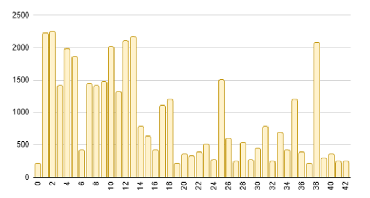

# GTSRB - The Unbiased Navigator

-blue?style=for-the-badge)


## Advanced Optimizations and Classification 99.6% of GTSRB Road Signs
This project is a case study on the robustness and efficiency of convolutional neural networks (CNNs) applied to the **German Traffic Sign Recognition Benchmark ([GTSRB](https://www.kaggle.com/datasets/meowmeowmeowmeowmeow/gtsrb-german-traffic-sign))**. The goal was to overcome the main challenge of the dataset —**class imbalance**— and compare performance between traditional, regularized, and ultra-efficient architectures.

## 1. The Problem and the Methodological Solution

### 1.1 The Algorithmic Bias Challenge
The GTSRB is plagued by a strong class imbalance (Class Imbalance). The model trained on this data develops a bias, penalizing accuracy on rare road signs.


### 1.2 Strategic Data Augmentation
To build an unbiased classifier (**The Unbiased Navigator**), I developed a **targeted oversampling pipeline** in the training set. Classes below a target threshold were balanced using advanced Data Augmentation, which includes geometric (such as Shift and Shear Mapping) and photometric (Gaussian Noise, brightness variations) transformations.

*The methodology ensures that the model is trained on a balanced set, but evaluated on Validation and Test sets that maintain the unbalanced real-world distribution, confirming generalization.*

## 2. Architectural Comparison and Final Results 🥇

I compared four network architectures —each representing a different design philosophy— to find the best balance between performance and computational cost.

| Model | Design philosophy | Total parameters | Test accuracy | Efficiency |
| :--- | :--- | :--- | :--- | :--- |
| **Gazebo** | Baseline (LeNet-5 like) | 2.03M | 98.4% | Fast convergence, no regularization |
| **Plion** | Deep regularization (BN + Dropout) | 2.23M | **99.61%** | Best Accuracy Overall |
| **Creatures** | **Efficiency, depth** (Separable Conv)| 1.40M | 99.59% | **Recommended model;** best trade-off between performance and lightness |
| **Berlin** | Ultra Efficiency (MobileNet-like DWSConv) | **0.11M (107k)** | 98.06% | **20x lighter** than Creatures ideal for edge devices |

The **Plion** network reached peak accuracy, but **Creatures** stood out as the ideal production model thanks to its exceptional efficiency (1.4M parameters) which maintains an accuracy of 99.59%. The **Berlin** network has demonstrated the feasibility of high-performance classifiers with minimal resources.

## 3. Structure of the Repository

| Folder | Content | Role |
| :--- | :--- | :--- |
| `/script` | `make_dataset`, `divide_dataset`, `ampliate_dataset`, ecc. | Contains all the pipelines for pre-processing, splitting, and layered Data Augmentation |
| `/network` | Model definition file (`.py`) | Definitions of the Gazebo, Plion, Creatures and Berlin networks |
| `/model` | Trained models (`.h5`) | Weights trained for fast inference |
| `/graph` | Images of the analysis and training history graphs | Visual documentation of workflow effectiveness |

## 4. How to Run the Project
- **Clone the Repository**:
  
  ```bash
  git clone https://github.com/gandrea51/The-Unbiased-Navigator.git
  cd The-Unbiased-Navigator
  ```
- **Requirements**: Install dependencies from ```requirements.txt```.
- **Dataset**: Download the original GTSRB dataset and place it in the data structure expected by the script.
- **Pipeline**: Run the scripts sequentially to create the balanced dataset (see the files in /script/ for execution order).
- **Training**: Run the main script to train one of the architectures. 
